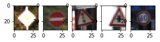

**Build a Traffic Sign Recognition Project**

The goals / steps of this project are the following:
* Load the data set (see below for links to the project data set)
* Explore, summarize and visualize the data set
* Design, train and test a model architecture
* Use the model to make predictions on new images
* Analyze the softmax probabilities of the new images
* Summarize the results with a written report

## Rubric Points
Here, I will consider the [rubric points](https://review.udacity.com/#!/rubrics/481/view) individually and describe how I addressed each point in my implementation.  

---
My project code is [here](https://github.com/udacity/CarND-Traffic-Sign-Classifier-Project/blob/master/Traffic_Sign_Classifier.ipynb).

### Data Set Summary & Exploration
I used the simple python methods to calculate summary statistics of the traffic signs data set:

* The size of training set is ***34799***
* The size of the validation set is ***4410***
* The size of test set is ***12630***
* The shape of a traffic sign image is ***(32, 32)***
* The number of unique classes/labels in the data set is ***43***

Here is an exploratory visualization of the data set. It is a histogram of the number of the images according to the class. Actually, the number of images in each class is different each other reflecting its "real" opportunities to see.

### Design and Test a Model Architecture
#### 1. Pre-processing

As a first step, I decided to use the RGB color images directly as inputs because the color information is one of the most important features for traffic sign recognition, i.e., the traffic signs are usually designed as easy-to-find symbols. I simply normalize pixel values in [-1, 1] by subtracting 128 then dividing 128.

#### 2. Network architecture
My final model consisted of the following layers:

| Layer         		|     Description	                                  |
|:-----------------:|:-------------------------------------------------:|
| Input         		| 32x32x3 RGB image                                 |
| Convolution 5x5  	| 1x1 stride, valid padding, outputs 28x28x6        |
| RELU					    |                                                   |
| Max pooling       | 2x2 stride,  outputs 14x14x6                      |
| Convolution 5x5   | 1x1 stride, valid padding, outputs 10x10x16       |
| RELU					    |                                                   |
| Max pooling       | 2x2 stride,  outputs 5x5x16                       |
| Flatten           | outputs 400                                       |
| Fully connected   | outputs 120                                       |
| RELU					    |                                                   |
| Fully connected   | outputs 84                                        |
| RELU					    |                                                   |
| Fully connected   | outputs 43                                        |

The base architecture of the model comes from LeNet, but input layer is slightly modified because I employed color input images. Also output layer is expand to 43 nodes with the number of traffic sign classes.

#### 3. Training
To train the model, I used an AdamOptimizer as an optimizer. The weight values of the networks are randomly initialized via Gaussian distribution with mean 0, variance 0.01. Other hyperparameters are below:
* number of epochs: 100
* batch size: 128
* learning rate: 0.001

#### 4. Results & discussion

My final model results were:
* training set accuracy of 100%
* validation set accuracy of 94.0%
* test set accuracy of 93.5%

I employed almost same architecture with LeNet, but modified input layer for RGB image inputs. Also, I set the number of epochs 100 because I used RGB images as inputs and thus the number of the network parameters becomes larger than the number of the LeNet's parameters.

As the result, the validation accuracy exceeds 94%, and the test accuracy is almost same level as 93.5%. But my concern is the too high training accuracy (100%). It seems loose robustness of the model.

###Test a Model on New Images
####1. Ten German traffic signs

Here are five German traffic signs that randomly extracted from test dataset:

The first image might be difficult to classify because its contrast quality is not so good. Also, classifying 4th and 5th images is a little confusing because of the primal difference between them is just direction of the arrows. Most of color information seems similar.

Here are other five images:

In this five images, 3rd and 4th images are difficult to classify because the shape and colors of the signs are almost same.

####2. The model's predictions

Here are the results of the prediction:

| Image			            |     Prediction	        					|
|:---------------------:|:---------------------------------------------:|
| Wild animals crossing | Wild animals crossing   									|
| No passing for vehicles over 3.5 metric tons | No passing for vehicles over 3.5 metric tons 										|
| Stop | Stop											|
| Go straight or left | Go straight or left					 				|
| Turn right ahead    | Turn right ahead      							|
| Priority road       | Priority road |
| No entry            | No entry      |
| Traffic signals     | Road work     |
| Right-of-way at the next intersection | End of no passing |
| Speed limit (60km/h) | Speed limit (60km/h) |

The model was able to correctly guess 8 of the 10 traffic signs, which gives an accuracy of 80%.

#### 3. How certain the model for prediction and discussion
The softmax probability of the model is almost 1 for all correct case described above. I had two of false examples, and top 5 probabilities for the two examples.

**8th image:**

| Probability         	|     Prediction	        					|
|:---------------------:|:---------------------------------------------:|
| .985         			| Road work   									|
| .015     				| Traffic signals 										|
| .00					| Bumpy road											|
| .00	      			| General caution					 				|
| .00				    | Road narrows on the right      							|

**9th image:**

| Probability         	|     Prediction	        					|
|:---------------------:|:---------------------------------------------:|
| .981         			| End of no passing   									|
| .018     				| Children crossing 										|
| .00					| Ahead only											|
| .00	      			| Pedestrians					 				|
| .00				    | Vehicles over 3.5 metric tons prohibited |

For 8th image, I had a correct answer with the 2nd largest probability. But even in this case, the largest probability is more than 98%, i.e., the model predict wrong class with strong confidence. Actually in my case, validation error during learning phase is not decreasing, but training error becomes 0 and robustness of the model may be lost with pretty large number of epochs. To avoid this issue, I may need to prepare additional training data by augmenting and contaminating the original image, or utilizing CG data. Using CG data seems good idea to prepare additional data because traffic sign itself is well-defined and the main cause of diverse comes from difference of lighting and view points.
